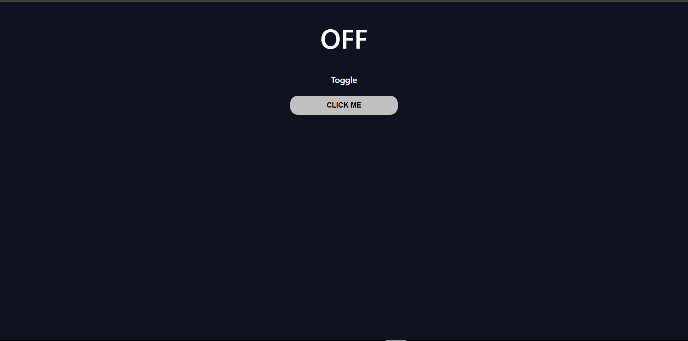

# Toggle Text (ON / OFF)

## 📌 Project Description
This mini project demonstrates how HTML, CSS, and JavaScript work together to change content dynamically using user interaction.

## 🎯 Objective
Create a simple page with a heading that toggles between **ON** and **OFF** when a button is clicked.

## 🛠️ Technologies Used
- HTML
- CSS
- JavaScript (

## ✨ Features
- Centered layout using Flexbox
- Styled text and button
- Responsive design for all screen sizes

## ▶️ How It Works
- Page loads with **OFF** displayed
- Clicking the **Toggle** button switches the text to **ON**
- Clicking again switches it back to **OFF**

## 📁 Files
- `index.html`
- `style.css`
- `java.js`
